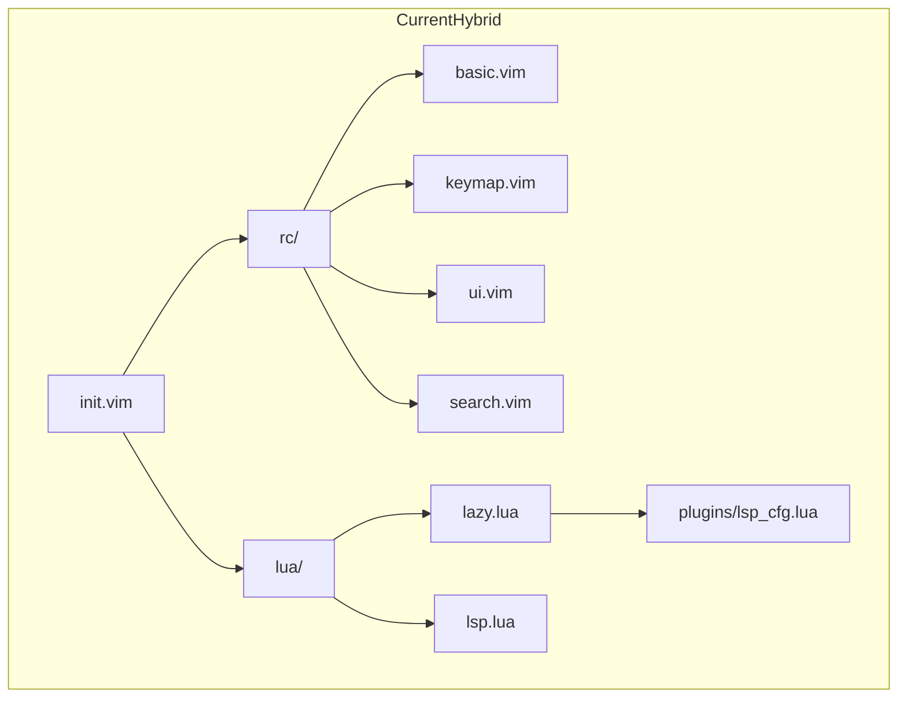
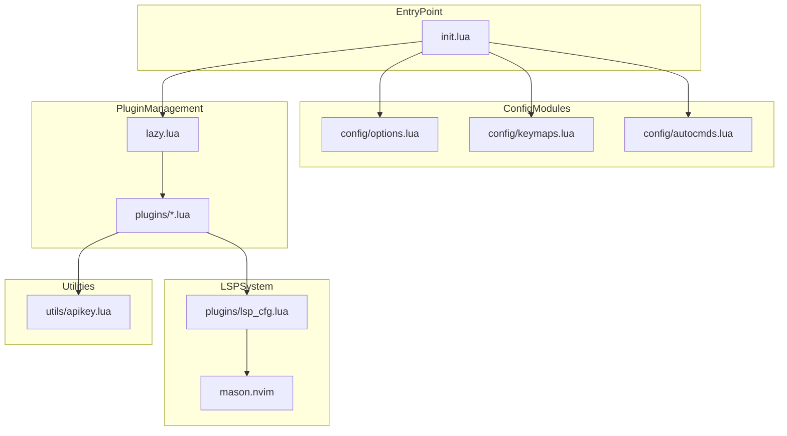
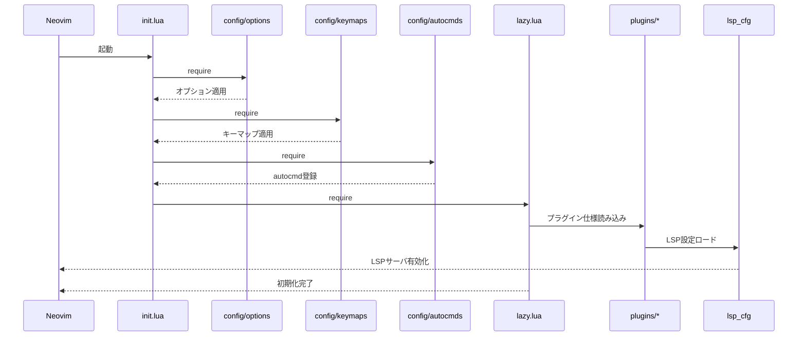
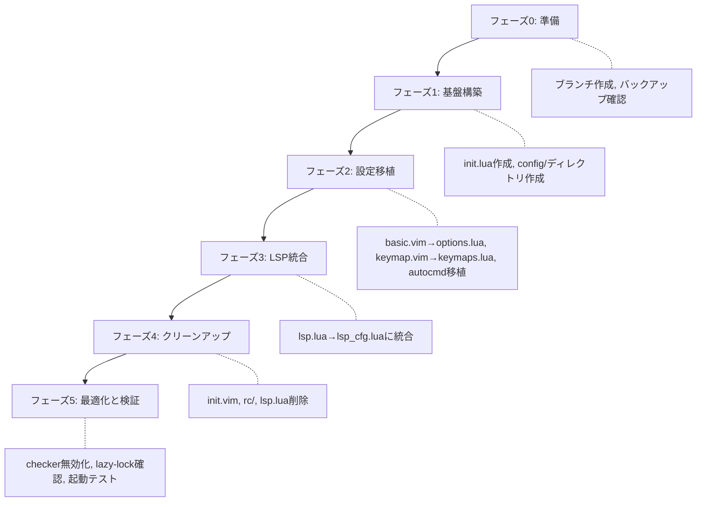

# 技術設計書: neovim-config-modernization

## 概要

**目的**: 本機能は、Neovim設定をVim scriptからLuaへ完全移行し、LSP設定を一元化し、レガシーコードを削除することで、設定の保守性・性能・安全性を向上させる。

**対象ユーザ**: dotfiles管理者（本人）が設定の追加・変更・デバッグを容易に行えるようにする。

**影響**: 現在のハイブリッド構成（`init.vim` + `rc/*.vim` + `lua/`）を、純粋なLuaベース構成（`init.lua` + `lua/config/` + `lua/plugins/`）に置き換える。

### ゴール
- エントリポイントを `init.lua` に統一し、Vim scriptへの依存を排除する
- LSP設定を単一ファイル（`plugins/lsp_cfg.lua`）に集約する
- TODOマーカー、コメントアウトコード、未使用設定を全て削除する
- プラグイン遅延ロードと起動最適化を徹底する
- APIキー管理の安全性を確保する
- 段階的移行とロールバック手順を確立する

### 非ゴール
- 新規プラグインの追加（既存プラグインの移行・整理のみ）
- Vim（非Neovim）との互換性維持
- 設定の機能追加（現状機能の維持が目的）

## アーキテクチャ

> 詳細な調査ログは `research.md` を参照。本設計書は自己完結するようにすべての決定事項を含む。

### 既存アーキテクチャ分析

**現状の構成**:


**課題**:
- `init.vim` がVim scriptの `runtime!` で設定をロードしており、Lua移行の障害
- `lsp.lua` と `plugins/lsp_cfg.lua` でLSPサーバ設定が二重定義（10サーバが重複）
- `rc/basic.vim` に5件のTODOマーカーとコメントアウトコードが存在
- `lazy.lua` で `checker.enabled = true` となっており、自動更新チェックが有効

### アーキテクチャパターン & 境界マップ



**アーキテクチャ統合**:
- **選択パターン**: モジュラー設定アーキテクチャ（LazyVimスターター準拠）
- **ドメイン境界**: 設定（config）、プラグイン仕様（plugins）、ブートストラップ（lazy.lua）、ユーティリティ（utils）を分離
- **維持する既存パターン**: Lazy.nvimによるプラグイン管理、Mason経由のLSPサーバインストール
- **新規コンポーネントの根拠**: `config/` ディレクトリはVim script設定のLua移植先として必要、`utils/` はAPIキー管理の共通化に必要

### 技術スタック

| レイヤ | 選択 / バージョン | 機能における役割 | 備考 |
|--------|------------------|-----------------|------|
| ランタイム | Neovim 0.11+ | Lua設定とネイティブLSP APIのサポート | `vim.lsp.config()`, `vim.lsp.enable()` を使用 |
| プラグイン管理 | lazy.nvim (latest) | プラグインの宣言的管理と遅延ロード | 既存導入済み、`lazy-lock.json` でバージョン固定 |
| LSPインフラ | mason.nvim | LSPサーバの自動インストール | 既存導入済み |
| 設定言語 | Lua | 全設定をLuaで記述 | Vim script廃止 |

## システムフロー

### Neovim起動時の設定ロードフロー



**フロー決定**:
- 設定モジュールは `require` で明示的にロードし、読み込み順序を制御
- プラグインは `lazy.nvim` により遅延ロード、起動時間を最小化
- LSPはファイルタイプに応じて遅延アタッチ

## 要件トレーサビリティ

| 要件 | 概要 | コンポーネント | インターフェース | フロー |
|------|------|---------------|-----------------|--------|
| 1.1 | Luaモジュールのrequireで設定をロード | init.lua, config/* | require() | 起動フロー |
| 1.2 | Vim script設定を起動時に読み込まない | init.lua | - | init.vim削除 |
| 1.3 | ロード順序を明確化、重複読み込み防止 | init.lua, config/* | require() | 起動フロー |
| 2.1 | 単一の集中設定からLSP適用 | plugins/lsp_cfg.lua | vim.lsp.config(), vim.lsp.enable() | LSP初期化 |
| 2.2 | 重複設定を無効化 | - | - | lsp.lua削除 |
| 2.3 | LSP共通設定を一元管理 | plugins/lsp_cfg.lua | vim.diagnostic.config() | LSP初期化 |
| 2.4 | 新LSPサーバを単一場所で追加 | plugins/lsp_cfg.lua | lsp_servers テーブル | 設定追加 |
| 3.1 | 未参照ファイルを含まない | - | - | rc/削除, lsp.lua削除 |
| 3.2 | コメントアウト旧設定を保持しない | config/* | - | 移植時に除外 |
| 3.3 | TODOマーカーを含まない | config/* | - | 移植時に削除 |
| 3.4 | 関連設定を同時削除 | - | - | 削除作業 |
| 4.1 | 遅延ロード | plugins/*.lua | lazy.nvim event/cmd | 起動フロー |
| 4.2 | updatetimeを明示設定 | config/options.lua | vim.opt.updatetime | 起動フロー |
| 4.3 | 自動更新チェック無効 | lazy.lua | checker.enabled = false | 起動フロー |
| 5.1 | APIキーを環境変数から取得 | utils/apikey.lua, plugins/ai_*.lua | vim.env | プラグイン設定 |
| 5.2 | APIキー未設定時に警告表示 | utils/apikey.lua | vim.notify | プラグイン初期化 |
| 5.3 | 外部ソース実行をデフォルト無効 | config/options.lua | exrc, secure | 起動フロー |
| 5.4 | 明示的オプトインで有効化 | config/options.lua | 条件付き設定 | 起動フロー |

## コンポーネントとインターフェース

### コンポーネントサマリ

| コンポーネント | ドメイン/レイヤ | 意図 | 要件カバレッジ | 主要依存関係 | コントラクト |
|---------------|----------------|------|---------------|-------------|-------------|
| init.lua | エントリポイント | 設定ロードの起点として各モジュールをrequire | 1.1, 1.2, 1.3 | config/*, lazy.lua (P0) | - |
| config/options.lua | 設定 | 基本オプション設定 | 1.1, 4.2, 5.3, 5.4 | - | - |
| config/keymaps.lua | 設定 | キーマップ一元定義 | 1.1, 3.2, 3.3 | - | - |
| config/autocmds.lua | 設定 | 自動コマンド定義 | 1.1, 3.2, 3.3 | - | - |
| lazy.lua | プラグイン管理 | Lazy.nvimブートストラップ | 4.1, 4.3 | plugins/* (P0) | - |
| plugins/lsp_cfg.lua | LSP | LSPサーバ設定・有効化・診断設定を一元管理 | 2.1, 2.2, 2.3, 2.4 | mason.nvim (P0) | Service |
| utils/apikey.lua | ユーティリティ | APIキーの存在チェックと警告表示 | 5.1, 5.2 | - | Service |

### 設定レイヤ

#### init.lua

| フィールド | 詳細 |
|----------|------|
| 意図 | Neovim起動時のエントリポイントとして、設定モジュールとプラグイン管理をロードする |
| 要件 | 1.1, 1.2, 1.3 |

#### 責務と制約
- 各設定モジュール (`config/options`, `config/keymaps`, `config/autocmds`) を `require` でロード
- `lazy.lua` を `require` してプラグイン管理を初期化
- Vim script (`rc/*.vim`) への参照を持たない
- **ロード順序**: options → keymaps → autocmds → lazy（この順序は厳守）

#### 依存関係
- Outbound: config/options.lua — 基本オプション適用 (P0)
- Outbound: config/keymaps.lua — キーマップ適用 (P0)
- Outbound: config/autocmds.lua — autocmd登録 (P0)
- Outbound: lazy.lua — プラグイン管理初期化 (P0)

**コントラクト**: なし

#### 実装ノート
- 統合: `require("config.options")`, `require("config.keymaps")`, `require("config.autocmds")`, `require("lazy")` の順でロード
- 検証: 各モジュールがエラーなくロードされることを起動テストで確認
- リスク: ロード順序を誤ると `mapleader` 未設定でプラグインキーマップが動作しない

---

#### config/options.lua

| フィールド | 詳細 |
|----------|------|
| 意図 | Neovimの基本オプション（エンコーディング、インデント、UI、セキュリティ設定）を定義する |
| 要件 | 1.1, 4.2, 5.3, 5.4 |

#### 責務と制約
- `vim.opt` を使用してオプションを設定
- 現 `rc/basic.vim`, `rc/ui.vim`, `rc/search.vim` の内容をLuaに移植
- TODOマーカーやコメントアウトコードは除外

#### 依存関係
- なし

**コントラクト**: なし

#### 実装ノート
- 統合: `vim.opt.updatetime = 300` を明示設定 (要件 4.2)
- 統合: `vim.opt.exrc = false` でローカルvimrcの自動実行を無効化 (要件 5.3)
- 統合: `vim.opt.secure = true` でセキュアモードを有効化 (要件 5.4)
- 移植元: `basic.vim` (153行), `ui.vim` (64行), `search.vim` (19行)

---

#### config/keymaps.lua

| フィールド | 詳細 |
|----------|------|
| 意図 | 汎用キーマップを一元定義する |
| 要件 | 1.1, 3.2, 3.3 |

#### 責務と制約
- `vim.keymap.set` を使用してキーマップを定義
- 現 `rc/keymap.vim` (72行) の内容をLuaに移植
- 未使用キーマップは移植しない

#### 依存関係
- なし

**コントラクト**: なし

#### 実装ノート
- 統合: プラグイン固有のキーマップは各プラグイン設定内で定義（ここには含めない）
- 移植元: `keymap.vim` (72行)

---

#### config/autocmds.lua

| フィールド | 詳細 |
|----------|------|
| 意図 | 汎用autocmdを一元定義する |
| 要件 | 1.1, 3.2, 3.3 |

#### 責務と制約
- `vim.api.nvim_create_autocmd` を使用してautocmdを定義
- 現 `rc/basic.vim` 内の `augroup` をLuaに移植（WezTerm連携含む）
- コメントアウトされたautocmdは移植しない

#### 依存関係
- なし

**コントラクト**: なし

#### 実装ノート
- 統合: WezTerm IME連携用の `InsertLeave`, `InsertEnter`, `CmdlineEnter`, `CmdlineLeave`, `VimEnter` autocmdを移植
- 統合: `augroup` は `vim.api.nvim_create_augroup` で作成

---

### プラグイン管理レイヤ

#### lazy.lua

| フィールド | 詳細 |
|----------|------|
| 意図 | Lazy.nvimをブートストラップし、プラグイン仕様をインポートする |
| 要件 | 4.1, 4.3 |

#### 責務と制約
- Lazy.nvimのインストール確認とパス設定
- `mapleader`, `maplocalleader` の設定（プラグインロード前に必要）
- プラグイン仕様を `plugins/` からインポート
- **`checker = { enabled = false }`** に変更して自動更新チェックを無効化 (要件 4.3)
- **`lockfile` 設定を明示化し `lazy-lock.json` でバージョン固定**

#### 依存関係
- Outbound: plugins/*.lua — プラグイン仕様読み込み (P0)
- External: lazy.nvim — プラグイン管理ライブラリ (P0)

**コントラクト**: なし

#### 実装ノート
- 変更: 現状 `checker = { enabled = true }` を `checker = { enabled = false }` に修正
- セキュリティ: `lazy-lock.json` をGit管理下に置き、プラグインバージョンを固定
- 更新ポリシー: `:Lazy update` を手動実行、更新後は動作確認してからcommit

---

### LSPレイヤ

#### plugins/lsp_cfg.lua

| フィールド | 詳細 |
|----------|------|
| 意図 | LSPサーバの設定・有効化・診断設定を一元管理する |
| 要件 | 2.1, 2.2, 2.3, 2.4 |

#### 責務と制約
- `mason.nvim` を統合してLSPサーバを自動インストール
- `vim.lsp.config()` でサーバ設定を定義、`vim.lsp.enable()` で有効化
- `vim.diagnostic.config()` で診断設定を一元管理
- LSP関連キーマップを定義（現 `lsp.lua` から移植）
- **削除対象の `lua/lsp.lua` の残存設定を吸収**

#### 依存関係
- External: mason.nvim — LSPサーバインストール (P0)
- Inbound: lazy.nvim — プラグインロード (P0)

**コントラクト**: Service [x] / API [ ] / Event [ ] / Batch [ ] / State [ ]

##### サービスインターフェース

```lua
---@class LspServerConfig
---@field cmd string[]? コマンドと引数（省略時はデフォルト）
---@field filetypes string[] 対象ファイルタイプ
---@field root_markers? string[] ルートディレクトリマーカー
---@field settings? table サーバ固有設定
---@field on_attach? fun(client: vim.lsp.Client, bufnr: integer) アタッチ時コールバック

---@type table<string, LspServerConfig>
local lsp_servers = {
  -- Python
  basedpyright = {
    filetypes = { "python" },
    root_markers = { "pyproject.toml", "setup.py", "setup.cfg", ".git" },
    settings = {
      basedpyright = {
        analysis = {
          autoSearchPaths = true,
          diagnosticMode = "openFilesOnly",
          useLibraryCodeForTypes = true,
        },
      },
    },
  },
  pylsp = {
    filetypes = { "python" },
    -- basedpyrightとの併用時は diagnostics を無効化
  },

  -- Shell
  bashls = {
    filetypes = { "sh", "bash", "zsh" },
  },

  -- Docker
  dockerls = {
    filetypes = { "dockerfile" },
  },

  -- Web
  html = {
    filetypes = { "html" },
  },
  jsonls = {
    filetypes = { "json", "jsonc" },
  },

  -- Lua
  lua_ls = {
    filetypes = { "lua" },
    settings = {
      Lua = {
        runtime = { version = "LuaJIT" },
        diagnostics = { globals = { "vim" } },
        workspace = { checkThirdParty = false },
        telemetry = { enable = false },
      },
    },
  },

  -- Vim
  vimls = {
    filetypes = { "vim" },
  },

  -- YAML
  yamlls = {
    filetypes = { "yaml", "yaml.docker-compose" },
  },

  -- PHP
  intelephense = {
    filetypes = { "php" },
  },
}
```

- 事前条件: Neovim 0.11以上、Masonでサーバがインストール済み
- 事後条件: 対象ファイルタイプを開いた際にLSPがアタッチされる
- 不変条件: 同一サーバの設定は単一箇所でのみ定義
- フォールバック: サーバ未インストール時は警告表示し、該当言語のLSP機能を無効化

#### 実装ノート
- 統合: `lsp.lua` の `vim.diagnostic.config()` 設定をこのファイルに移動
- 統合: `lsp.lua` のLSPキーマップ (`K`, `gf`, `gr` 等) をこのファイルに移動
- 統合: `updatetime=300` は `config/options.lua` に移動（LSP設定から分離）
- 統合完了後: `lua/lsp.lua` を削除
- 検証: 各ファイルタイプを開いてLSPがアタッチされることを確認

---

### ユーティリティレイヤ

#### utils/apikey.lua

| フィールド | 詳細 |
|----------|------|
| 意図 | AIプラグイン用のAPIキー存在チェックと警告表示を提供する |
| 要件 | 5.1, 5.2 |

#### 責務と制約
- 環境変数からAPIキーを取得
- キーが未設定の場合は `vim.notify` で警告を表示
- キーが存在する場合は値を返す

#### 依存関係
- なし

**コントラクト**: Service [x] / API [ ] / Event [ ] / Batch [ ] / State [ ]

##### サービスインターフェース

```lua
---@class ApiKeyResult
---@field key string? APIキー（未設定時はnil）
---@field valid boolean キーが有効か

---@param env_var string 環境変数名
---@param plugin_name string プラグイン名（警告表示用）
---@return ApiKeyResult
local function get_api_key(env_var, plugin_name)
  local key = vim.env[env_var]
  if not key or key == "" then
    vim.notify(
      string.format("[%s] APIキーが未設定です。環境変数 %s を設定してください。", plugin_name, env_var),
      vim.log.levels.WARN
    )
    return { key = nil, valid = false }
  end
  return { key = key, valid = true }
end
```

- 事前条件: なし
- 事後条件: キー未設定時は警告が表示される
- 不変条件: 環境変数の値を変更しない

#### 実装ノート
- 統合: `avante.lua`, `minuet-ai.lua` 等でこのユーティリティを使用
- 統合: `enabled` フラグと組み合わせて、キー未設定時にプラグインを無効化可能

## エラーハンドリング

### エラー戦略

設定ファイルのエラーは起動時に即座に表示し、問題の特定を容易にする。

### エラーカテゴリと対応

**設定エラー**:
- モジュール読み込み失敗 → `pcall` でラップし、エラーメッセージを `vim.notify` で表示
- LSPサーバ起動失敗 → `vim.lsp.handlers` でエラーをキャッチし通知
- **サーバ未インストール** → 警告表示し、該当言語のLSP機能を無効化して続行

**APIキーエラー**:
- 未設定 → 警告表示、該当プラグインを無効化（要件 5.2）

### モニタリング

- 起動時間: `:Lazy profile` でプラグインロード時間を確認
- LSPステータス: `:LspInfo` でアタッチ状況を確認

## テスト戦略

### ユニットテスト
- `utils/apikey.lua`: キー存在/不在時の戻り値と警告表示を検証
- `config/options.lua`: 主要オプションが期待通りに設定されているか検証

### 統合テスト
- Neovim起動: エラーなく起動し、全モジュールがロードされるか
- LSPアタッチ: Python, Lua, YAML等のファイルを開いた際にLSPがアタッチされるか
- キーマップ: 主要キーマップ（`;` → `:`, 分割移動等）が動作するか

### E2Eテスト
- 完全な起動〜編集〜保存フロー: 設定変更後にNeovimが正常に動作するか
- WezTerm連携: IME制御が期待通りに動作するか（手動確認）

### 移行テストチェックリスト
各フェーズ完了後に以下を確認:
- [ ] `nvim --headless +qa` がエラーなく終了
- [ ] `:checkhealth` で重大エラーなし
- [ ] 主要ファイルタイプ（.py, .lua, .yaml）でLSPアタッチ
- [ ] 基本キーマップ（`;` → `:`, `<C-h/j/k/l>` 分割移動）動作

## セキュリティ考慮事項

### プラグイン管理とサプライチェーンセキュリティ

**バージョン固定とロックファイル管理**:
- `lazy-lock.json` をGitで管理し、プラグインバージョンを固定
- 更新は `:Lazy update` で手動実行、動作確認後にcommit
- 定期更新ルール: 月1回程度、セキュリティパッチは即時対応

**取得元の制限**:
- Lazy.nvimはGitHub公式リポジトリからのみインストール（デフォルト動作）
- フォークや非公式リポジトリは使用しない

**APIキー管理**:
- 環境変数経由で取得し、設定ファイルにハードコードしない (要件 5.1)
- 未設定時は警告表示し、該当プラグインを無効化 (要件 5.2)

**外部ソース実行**:
- `vim.opt.exrc = false`, `vim.opt.secure = true` でローカルvimrcの自動実行を禁止 (要件 5.3, 5.4)

## マイグレーション戦略

### 移行フェーズ概要



### 詳細移行手順

#### フェーズ0: 準備（ロールバック基盤）
**目的**: 安全な移行基盤を確立
- 作業ブランチを作成 (`git checkout -b nvim-lua-migration`)
- 現状の設定が動作することを確認
- **ロールバック手順**: `git checkout main -- vim/` で即座に復旧可能

#### フェーズ1: 基盤構築
**目的**: Lua設定の受け皿を作成
- `init.lua` を新規作成（最初は `init.vim` を source する互換モード）
- `lua/config/` ディレクトリを作成
- **互換モード期間**: `init.lua` から `vim.cmd("source " .. vim.fn.stdpath("config") .. "/init.vim")` で既存設定を読み込む
- **完了条件**: `init.lua` 経由で既存設定が動作すること
- **ロールバック**: `init.lua` を削除し、`init.vim` に戻す

#### フェーズ2: 設定移植
**目的**: Vim scriptをLuaに変換
- `basic.vim` → `config/options.lua` に移植
- `keymap.vim` → `config/keymaps.lua` に移植
- `ui.vim`, `search.vim` → `config/options.lua` に統合
- autocmd → `config/autocmds.lua` に移植
- **段階的切り替え**: 各モジュール移植完了ごとに `init.lua` を更新し、対応する `runtime!` を削除
- **完了条件**: 全移植が終わり、`init.vim` からの `runtime! rc/*.vim` が不要になること
- **ロールバック**: 移植済みモジュールの `require` を削除し、`runtime!` を復活

#### フェーズ3: LSP統合
**目的**: LSP設定の重複を解消
- `lsp.lua` の診断設定・キーマップを `lsp_cfg.lua` に移動
- `updatetime=300` を `config/options.lua` に移動
- 全サーバ（10個）の設定を `lsp_servers` テーブルに統合
- **完了条件**: 全ファイルタイプでLSPがアタッチされること
- **ロールバック**: `lsp.lua` を復活し、`lsp_cfg.lua` の変更をrevert

#### フェーズ4: クリーンアップ
**目的**: レガシーファイルを削除
- `init.vim` の互換モード記述を削除
- `rc/` ディレクトリを削除
- `lua/lsp.lua` を削除
- **完了条件**: `nvim --headless +qa` がエラーなしで終了
- **ロールバック**: Gitから削除ファイルを復活 (`git checkout HEAD~1 -- vim/rc/ vim/init.vim vim/lua/lsp.lua`)

#### フェーズ5: 最適化と検証
**目的**: 要件達成を確認
- `lazy.lua` の `checker.enabled = false` を確認
- `lazy-lock.json` がGit管理されていることを確認
- `:Lazy profile` で起動時間を確認
- 全テストチェックリストを実行
- **完了条件**: 全テスト合格、mainブランチにマージ

### ロールバックトリガ
各フェーズ完了後にNeovim起動テストを実施し、以下の場合は該当フェーズの変更をリバート:
- `nvim` 起動時にエラーが発生
- 主要機能（補完、LSP、キーマップ）が動作しない
- `:checkhealth` で重大エラー

### 互換モード詳細
**期間**: フェーズ1〜フェーズ3完了まで
**仕組み**: `init.lua` から `init.vim` を source し、移行済みモジュールは `require` で読み込む

```lua
-- init.lua (互換モード)
-- 移行済みモジュールを先にロード
require("config.options")
-- require("config.keymaps")  -- 移行完了後にアンコメント
-- require("config.autocmds") -- 移行完了後にアンコメント

-- 未移行の設定は既存Vim scriptから読み込み
vim.cmd("source " .. vim.fn.stdpath("config") .. "/init.vim")
```

**利点**: 移行中も常に動作する設定を維持でき、問題発生時は即座に切り戻し可能
