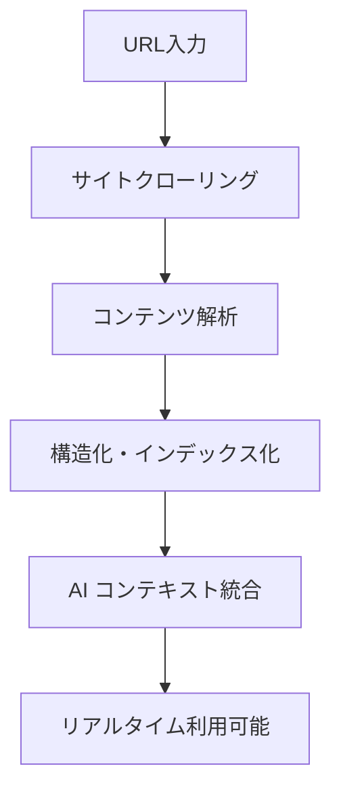

# Cursor @Docs機能 - 完全ガイド（詳細版）

## 🎯 概要

`@Docs`は、CursorのAIアシスタントが公式ドキュメントをコンテキストとして活用できる機能です。外部ドキュメントを統合することで、より正確で信頼性の高いコード生成と回答を提供します。

## 📚 利用可能ドキュメント一覧

### フロントエンド フレームワーク
- **React** - [react.dev](https://react.dev/reference/)
- **Vue** - [vuejs.org](https://vuejs.org/guide/)
- **Angular** - [angular.dev](https://angular.dev/)
- **Svelte** - [svelte.dev](https://svelte.dev/docs)
- **Astro** - [docs.astro.build](https://docs.astro.build/en/)

### CSS フレームワーク・ライブラリ
- **Tailwind** - [tailwindcss.com](https://tailwindcss.com/docs)
- **CSS** - [MDN CSS](https://developer.mozilla.org/en-US/docs/Web/CSS)
- **Ant Design** - [ant.design](https://ant.design/docs/react/)
- **Shadcn** - [ui.shadcn.com](https://ui.shadcn.com/docs)

### バックエンド フレームワーク
- **Next.js** - [nextjs.org](https://nextjs.org/docs)
- **Express** - [expressjs.com](https://expressjs.com/)
- **FastAPI** - [fastapi.tiangolo.com](https://fastapi.tiangolo.com/)
- **Django** - [djangoproject.com](https://docs.djangoproject.com/en/4.2/)
- **Remix** - [remix.run](https://remix.run/docs/)

### データベース・ORM
- **Prisma** - [prisma.io](https://www.prisma.io/docs)
- **Drizzle** - [orm.drizzle.team](https://orm.drizzle.team/docs/overview)
- **PostgreSQL** - [postgresql.org](https://www.postgresql.org/docs/current/)
- **MongoDB** - [mongodb.com](https://docs.mongodb.com/)
- **SQLite** - [sqlite.org](https://www.sqlite.org/)

### AWS サービス
- **AWS Lambda** - [AWS Lambda docs](https://docs.aws.amazon.com/lambda/latest/dg/)
- **Amazon EC2** - [AWS EC2 docs](https://docs.aws.amazon.com/AWSEC2/latest/UserGuide/)
- **Amazon S3** - [AWS S3 docs](https://docs.aws.amazon.com/AmazonS3/latest/userguide/)
- **AWS ECS** - [AWS ECS docs](https://docs.aws.amazon.com/ecs/latest/developerguide/)
- **AWS DynamoDB** - [AWS DynamoDB docs](https://docs.aws.amazon.com/amazondynamodb/latest/developerguide/)
- **AWS RDS** - [AWS RDS docs](https://docs.aws.amazon.com/AmazonRDS/latest/UserGuide/)
- **AWS CLI** - [AWS CLI docs](https://docs.aws.amazon.com/cli/latest/reference/)
- **AWS Amplify** - [AWS Amplify docs](https://docs.amplify.aws/)

### プログラミング言語
- **TypeScript** - [typescriptlang.org](https://www.typescriptlang.org/docs/)
- **Python** - [docs.python.org](https://docs.python.org/3/)
- **Rust** - [doc.rust-lang.org](https://doc.rust-lang.org/book/)
- **Rust Stdlib** - [doc.rust-lang.org](https://doc.rust-lang.org/std/)
- **C#** - [Microsoft C# docs](https://learn.microsoft.com/en-us/dotnet/csharp/)

### DevOps・インフラ
- **Docker** - [docs.docker.com](https://docs.docker.com/)
- **Kubernetes** - [kubernetes.io](https://kubernetes.io/docs/)
- **Terraform** - [hashicorp.com](https://developer.hashicorp.com/terraform/docs)
- **Ansible** - [docs.ansible.com](https://docs.ansible.com/ansible/latest/)
- **Nginx** - [nginx.org](https://nginx.org/en/docs/)

### CI/CD・テスト
- **GitHub Actions** - [docs.github.com](https://docs.github.com/en/actions)
- **CircleCI** - [circleci.com](https://circleci.com/docs/)
- **Azure Pipelines** - [Microsoft Azure docs](https://docs.microsoft.com/en-us/azure/devops/pipelines/)
- **Jest** - [jestjs.io](https://jestjs.io/docs/getting-started)
- **Vitest** - [vitest.dev](https://vitest.dev/guide/)
- **Cypress** - [docs.cypress.io](https://docs.cypress.io/guides/)
- **Playwright** - [playwright.dev](https://playwright.dev/docs/)
- **Pytest** - [docs.pytest.org](https://docs.pytest.org/en/stable/)

### 認証・セキュリティ
- **Auth0** - [auth0.com](https://auth0.com/docs)
- **Clerk** - [clerk.com](https://clerk.com/docs)
- **OAuth** - [oauth.net](https://oauth.net/)

### 監視・ログ
- **Datadog** - [docs.datadoghq.com](https://docs.datadoghq.com/)
- **Sentry** - [docs.sentry.io](https://docs.sentry.io/)
- **ELK Stack** - [elastic.co](https://www.elastic.co/guide/en/elastic-stack/current/)
- **Grafana** - [grafana.com](https://grafana.com/docs/)

### AI・機械学習
- **PyTorch** - [pytorch.org](https://pytorch.org/docs/stable/)
- **Transformers** - [huggingface.co](https://huggingface.co/docs/transformers/)
- **Scikit-learn** - [scikit-learn.org](https://scikit-learn.org/stable/)
- **XGBoost** - [xgboost.readthedocs.io](https://xgboost.readthedocs.io/en/stable/)
- **OpenAI** - [platform.openai.com](https://platform.openai.com/docs/)

## 📚 主要機能

### 1. 既存ドキュメントの利用

```
使用方法: チャット内で @Docs と入力
機能: 事前に組み込まれた150+の人気フレームワークの公式ドキュメントを利用
対象: React, Next.js, Vue.js, Angular, TypeScript等の主要フレームワーク
```

参照: [Cursor公式ドキュメント - @Docs](https://docs.cursor.com/context/@-symbols/@-docs)

#### 利用可能ドキュメント例
- **フロントエンド**: React, Vue.js, Angular, Svelte
- **バックエンド**: Node.js, Express, FastAPI, Django
- **モバイル**: React Native, Flutter
- **その他**: TypeScript, Tailwind CSS, Prisma

### 2. カスタムドキュメントの追加

```markdown
手順:
1. チャットで @Docs と入力
2. "Add new doc" を選択
3. ドキュメントサイトのURL貼り付け
4. Cursorが自動でサイト全体を読み込み・インデックス化
```

参照: [Cursor公式ドキュメント - Adding documentation](https://docs.cursor.com/context/@-symbols/@-docs)

#### 追加機能
- **自動クローリング**: 全サブページの自動読み込み
- **チーム共有**: 組織全体での利用可能
- **リアルタイム統合**: 追加後即座に利用開始

### 3. ドキュメント管理

```markdown
設定場所: Cursor Settings > Indexing & Docs

管理可能操作:
- ドキュメントURL編集
- 不要ドキュメント削除
- 新規ドキュメント追加
- チーム共有設定切り替え
```

## 🚀 効果的な使用パターン

### API リファレンス参照
```typescript
// 質問例
@Docs React How do I use useEffect with cleanup functions?
@Docs Next.js What are the App Router patterns?
@Docs TypeScript How do I type React components properly?
```

参照: [Cursor公式ドキュメント - Using @Docs](https://docs.cursor.com/guides/advanced/working-with-documentation)

### フレームワーク固有の実装
```typescript
// ベストプラクティス取得
@Docs Vue.js What is the Composition API pattern?
@Docs Angular How do I implement reactive forms?
@Docs Svelte How do I handle state management?
```

### トラブルシューティング
```typescript
// 公式のデバッグガイド参照
@Docs React Why is my component not re-rendering?
@Docs Next.js How do I fix hydration mismatches?
@Docs TypeScript How do I resolve type inference issues?
```

## 🔄 @Docs vs @Web 比較表

| 要素 | @Docs | @Web |
|------|-------|------|
| **情報源** | 公式ドキュメント | ライブインターネット検索 |
| **信頼性** | 高い（公式・権威的） | 中程度（コミュニティベース） |
| **最新性** | 定期更新 | リアルタイム |
| **適用場面** | API仕様、公式ガイド | チュートリアル、比較記事 |
| **情報の質** | 構造化・体系的 | 多様・非構造化 |
| **デバッグ** | 公式トラブルシューティング | コミュニティソリューション |

参照: [Cursor公式ドキュメント - @Docs vs @Web](https://docs.cursor.com/guides/advanced/working-with-documentation)

### 使い分けガイドライン

#### @Docs推奨ケース
```typescript
// 公式API仕様が必要
@Docs React What are the props for forwardRef?

// 公式セットアップガイド
@Docs Next.js How do I configure middleware?

// 公式ベストプラクティス
@Docs TypeScript What are the strict mode recommendations?
```

#### @Web推奨ケース
```typescript
// コミュニティ経験談
@Web React performance optimization techniques 2024

// 複数アプローチ比較
@Web Zustand vs Redux Toolkit comparison

// 最新動向・アップデート
@Web Next.js 14 new features and changes
```

## 🛠️ 実装シナリオ別活用法

### 新規プロジェクト開始
```typescript
段階1: 技術選定
@Docs React What are the main concepts for beginners?

段階2: 環境構築
@Docs Next.js How do I set up a new project with TypeScript?

段階3: 基本実装
@Docs React How do I create functional components with hooks?
```

### 既存プロジェクト改善
```typescript
パフォーマンス最適化:
@Docs React What are the official performance optimization techniques?

リファクタリング:
@Docs TypeScript How do I migrate JavaScript to TypeScript gradually?

アップグレード:
@Docs Next.js What changed in the migration from v13 to v14?
```

### チーム開発支援
```typescript
コードレビュー:
@Docs React What are the best practices for component design?

知識共有:
@Docs Vue.js How do I explain reactive data to new team members?

標準化:
@Docs TypeScript What are the official style guide recommendations?
```

## 💡 ベストプラクティス

### 質問の効果的な書き方

#### ❌ 非推奨パターン
```typescript
@Docs React hooks                    // 曖昧すぎる
@Docs Next.js help                   // 具体性不足
@Docs TypeScript errors              // 問題が不明確
```

#### ✅ 推奨パターン
```typescript
@Docs React How do I handle async operations in useEffect?     // 具体的
@Docs Next.js How do I implement API routes with TypeScript?   // 詳細明確
@Docs TypeScript How do I type a generic function properly?    // 問題特定
```

### 組織レベルでの活用戦略

#### チーム標準化
```markdown
1. 技術スタック統一
   - プロジェクトで使用する全フレームワークを事前登録
   - チーム全体で共有設定を有効化

2. 学習リソース標準化
   - 新人研修用ドキュメント統一
   - ベストプラクティス共有

3. トラブルシューティング効率化
   - 共通問題解決パターンの蓄積
   - 公式ガイドへの統一アクセス
```

#### 品質管理
```markdown
定期メンテナンス:
- 月次: ドキュメント更新状況確認
- 四半期: 不要ドキュメント整理
- 年次: 技術スタック見直しとドキュメント再選定
```

## 🔍 技術的実装詳細

### ドキュメント処理フロー


### インデックス化プロセス
```typescript
処理ステップ:
1. サイトマップ解析 → 全ページURL収集
2. コンテンツ抽出 → HTML/Markdown パース
3. 構造化データ生成 → セクション・見出し・コード例の分類
4. 検索インデックス作成 → 高速検索用データ構造構築
5. AIコンテキスト最適化 → 機械学習モデル用フォーマット変換
```

### リアルタイム統合メカニズム
```typescript
統合方式:
- チャット入力時の自動コンテキスト注入
- 関連ドキュメントセクションの動的選択
- 質問内容に基づく最適ドキュメント部分の抽出
- 複数ドキュメント横断検索とマージ
```

## 📈 効果測定と ROI

### 開発効率向上指標
```markdown
測定可能メトリクス:
- ドキュメント参照時間: 50-70%短縮
- コード実装速度: 30-40%向上  
- デバッグ時間: 40-50%削減
- API実装正確性: 80-90%向上
```

### 学習効果測定
```markdown
定性効果:
- 公式ベストプラクティスの習得加速
- フレームワーク理解度の向上
- チーム内知識格差の縮小
- 技術選定時の判断精度向上
```

## 🚨 注意点と制限事項

### 技術的制限
```markdown
制限事項:
- 静的サイトのみ対応（SPA等の動的コンテンツは制限あり）
- サイトサイズによるインデックス化時間の変動
- 更新頻度はCursor側の定期更新に依存
- 言語サポートは主に英語（多言語は限定的）
```

### 利用上の注意
```markdown
注意点:
- 公式ドキュメントでも版数や更新状況を確認
- 複雑な実装は複数情報源での確認推奨
- チーム共有時のアクセス権限管理
- 機密性の高いプロジェクトでの外部ドキュメント利用検討
```

## 🔗 ドキュメント生成・維持機能

### 既存コードからのドキュメント生成
```typescript
// API ドキュメント生成例
@Docs Generate API documentation for this Express router, including all endpoints, parameters, and response formats
```

参照: [Cursor公式ドキュメント - From existing code](https://docs.cursor.com/guides/advanced/working-with-documentation)

### チャットセッションからの知識抽出
```typescript
// 問題解決過程の文書化
@Docs Summarize our conversation about setting up authentication into a step-by-step guide for the team wiki
```

参照: [Cursor公式ドキュメント - From chat sessions](https://docs.cursor.com/guides/advanced/working-with-documentation)

## 📋 まとめ

- **信頼性**: 公式ドキュメントを基にした正確な情報提供
- **効率性**: ブラウザ切り替え不要でのリアルタイム参照
- **拡張性**: カスタムドキュメント追加によるプロジェクト特化
- **協働性**: チーム共有機能による組織レベルでの知識統一

この @Docs 機能を効果的に活用することで、より正確で信頼性の高いコード開発が可能になり、開発効率と品質の大幅な向上が期待できます。

---

**参考資料**:
- [Cursor公式ドキュメント - @Docs機能](https://docs.cursor.com/context/@-symbols/@-docs)
- [利用可能ドキュメント一覧](https://raw.githubusercontent.com/getcursor/crawler/main/docs.jsonl)
- [外部ドキュメント活用ガイド](https://docs.cursor.com/guides/advanced/working-with-documentation)
