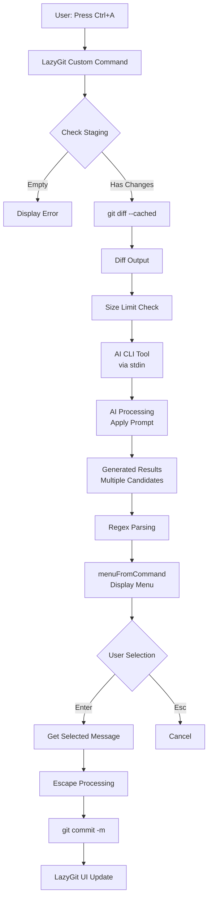

# Design Document

## Overview

This design leverages LazyGit's Custom Commands feature to natively integrate AI-powered commit message generation. The core of the design uses LazyGit's `menuFromCommand` prompt type to dynamically convert external AI CLI tool output into a menu, enabling users to complete visual confirmation and selection in a single operation.

The system follows these design principles:

1. **Zero Context Switch**: All operations complete within LazyGit's TUI, eliminating transitions to external editors or browsers
2. **Selection as Approval**: Menu selection acts as both visual confirmation and approval, creating an efficient UX pattern
3. **Pluggable AI Backend**: Switch between different AI services (Gemini, ChatGPT, Claude, Ollama, etc.) by only changing configuration files
4. **Security First**: Thorough shell injection prevention and error handling

## Architecture

### System Architecture Diagram



### Data Flow

1. **Input Phase**: Retrieve staging diff with `git diff --cached`
2. **Preprocessing Phase**: Check and truncate diff output size (token limit protection)
3. **AI Processing Phase**: Pass to AI CLI tool via pipeline, generate multiple candidates with structured prompt
4. **Parsing Phase**: Extract each line as menu item using regular expressions
5. **Selection Phase**: User navigates with keyboard and selects
6. **Execution Phase**: Escape selected text and pass to `git commit`

## Components and Interfaces

### 1. LazyGit Custom Command定義（config.yml）

LazyGitの設定ファイルに記述される宣言的な設定。以下の要素で構成される：

```yaml
customCommands:
  - key: "<c-a>"              # キーバインディング
    description: "..."         # コマンド説明
    context: "files"           # 有効なコンテキスト
    loadingText: "..."         # 実行中の表示
    command: "..."             # 最終実行コマンド
    prompts:                   # プロンプト定義
      - type: "menuFromCommand"
        title: "..."
        command: "..."         # メニュー生成コマンド
        filter: "..."          # 正規表現
        valueFormat: "..."     # 変数格納形式
        labelFormat: "..."     # 表示形式
```

**インターフェース仕様**:
- **入力**: ユーザーのキー入力（`<c-a>`など）
- **出力**: LazyGitへのコマンド実行指示
- **依存**: LazyGitのテンプレートエンジン（Go text/template）

### 2. Diff取得モジュール

**責務**: ステージングエリアの変更内容を取得し、AI処理に適した形式で提供

**実装**:
```bash
git diff --cached
```

**エラーハンドリング**:
- ステージングが空の場合は早期終了
- 実装例: `if git diff --cached --quiet; then echo "Error: No staged changes"; exit 1; fi`

**出力**: Unified Diff形式のテキストストリーム

### 3. サイズ制限モジュール

**責務**: 大規模なDiffがAIのトークン制限を超えないよう制御

**実装**:
```bash
git diff --cached | head -c 12000
```

**設計判断**:
- 12,000バイト（約12KB）を上限とする
- これは一般的なLLMのコンテキストウィンドウ（4K-8Kトークン）に対して安全なマージン
- 代替案: `git diff --cached --stat`で要約情報を併用

### 4. AI CLIインターフェース

**責務**: 外部AIツールとの通信を抽象化

**インターフェース仕様**:
- **入力**: stdin経由でDiffテキスト
- **出力**: stdout経由で改行区切りのコミットメッセージ候補（プレーンテキスト）
- **エラー**: stderr経由でエラーメッセージ

**プロンプト構造**:
```
Staged changes are provided via stdin.
Generate 5 commit messages following Conventional Commits format.
Rules:
- No markdown, no code blocks, no decorations
- One message per line
- No numbering (e.g., '1. ')
- Concise and descriptive
- Pure text output only
- Format: <type>(<scope>): <description>
```

**サポートするAIバックエンド**:
- Gemini CLI: `gemini generate --prompt "..."`
- OpenAI: `sgpt --no-md "..."`
- Claude: `claude-cli --stdin "..."`
- Ollama: `ollama run mistral "..."`

### 5. 正規表現パーサー

**責務**: AI出力から個別のメッセージを抽出

**実装**:
```regex
^(?P<msg>.+)$
```

**動作**:
- 各行をキャプチャグループ`msg`に格納
- LazyGitのGoテンプレートで`{{.msg}}`として参照可能

**エッジケース対応**:
- 番号付きリスト対応: `^\d+\.\s*(?P<msg>.+)$`
- 空行スキップ: `^(?P<msg>.+\S.*)$`

### 6. メニュー表示モジュール（menuFromCommand）

**責務**: 解析されたメッセージをインタラクティブなメニューとして表示

**設定**:
```yaml
valueFormat: "{{.msg}}"           # 変数に格納される値
labelFormat: "{{.msg | green}}"   # 画面表示（色付き）
```

**ユーザーインタラクション**:
- `↑/↓`: 候補間移動
- `Enter`: 選択確定
- `Esc`: キャンセル

### 7. コミット実行モジュール

**責務**: 選択されたメッセージで安全にgit commitを実行

**実装**:
```yaml
command: 'git commit -m {{.Form.SelectedMsg | quote}}'
```

**セキュリティ対策**:
- `| quote`フィルタでシェルエスケープ
- クォート、バックティック、セミコロンなどを無害化

**実行後処理**:
- LazyGitは自動的にUIを更新し、新しいコミットを表示

## Data Models

### CommitMessageCandidate

コミットメッセージ候補を表現するデータ構造（概念モデル）

```
CommitMessageCandidate {
  text: String          // メッセージ本文
  type: String          // Conventional Commitsタイプ（feat, fix, etc.）
  scope: String?        // スコープ（オプション）
  description: String   // 説明文
}
```

**制約**:
- `text`は改行を含まない（Subject lineのみ）
- `type`は有効なConventional Commitsタイプ
- 全体の長さは72文字以内（Git推奨）

### DiffContent

Diff情報を表現するデータ構造

```
DiffContent {
  raw: String           // 生のdiff出力
  truncated: Boolean    // サイズ制限で切り詰められたか
  byteSize: Integer     // バイトサイズ
}
```

### AIResponse

AI CLIツールからの応答

```
AIResponse {
  candidates: List<String>  // 生成されたメッセージのリスト
  exitCode: Integer         // プロセス終了コード
  stderr: String            // エラー出力
}
```

## Correctness Properties

*A property is a characteristic or behavior that should hold true across all valid executions of a system-essentially, a formal statement about what the system should do. Properties serve as the bridge between human-readable specifications and machine-verifiable correctness guarantees.*

### Property 1: 複数候補生成

*任意の*有効なdiff入力に対して、AIシステムは2個以上のコミットメッセージ候補を生成すること

**Validates: Requirements 2.1**

### Property 2: 正規表現解析の完全性

*任意の*改行区切りテキスト出力（各行が非空）に対して、正規表現パーサーは各行を個別のメッセージ候補として抽出すること

**Validates: Requirements 5.4**

### Property 3: シェルインジェクション防止

*任意の*コミットメッセージテキスト（特殊文字を含む）に対して、エスケープ処理後のコマンド文字列はシェルインジェクションを引き起こさないこと

**Validates: Requirements 4.2, 8.3**

### Property 4: Conventional Commits形式準拠

*任意の*diff入力に対して、生成される全てのコミットメッセージは有効なConventional Commits形式（`<type>(<scope>): <description>`または`<type>: <description>`）に従うこと

**Validates: Requirements 6.1**

### Property 5: Markdown除去

*任意の*生成されたコミットメッセージに対して、Markdown記号（`**`, `*`, `` ` ``, `#`, `-`など）が含まれないこと

**Validates: Requirements 6.3**

## Error Handling

### エラーカテゴリと対応戦略

#### 1. 入力エラー

**ケース**: ステージングエリアが空

**検出**: `git diff --cached --quiet`の終了コード確認

**対応**:
```bash
if git diff --cached --quiet; then 
  echo "Error: No staged changes. Please stage files first."
  exit 1
fi
```

**ユーザー体験**: LazyGitがエラーメッセージをポップアップ表示し、操作を中断

#### 2. サイズ超過エラー

**ケース**: Diffが12KB（設定値）を超える

**検出**: `head -c 12000`による切り詰め

**対応**: 警告なしで切り詰めを実行（透過的な処理）

**代替案**: 切り詰め前に警告を表示する場合は、事前チェックスクリプトを追加

#### 3. AI実行エラー

**ケース**: AI CLIツールが非ゼロ終了コードを返す

**検出**: パイプラインの終了コード確認

**対応**:
```bash
set -o pipefail
git diff --cached | ai-tool || { echo "AI tool failed"; exit 1; }
```

**ユーザー体験**: エラーメッセージ表示後、メニューは表示されず元の画面に戻る

#### 4. 解析エラー

**ケース**: AI出力が正規表現にマッチしない（空行のみ、不正な形式）

**検出**: menuFromCommandが空のメニューを生成

**対応**: LazyGitは自動的に「No items」と表示

**改善策**: AI出力の後処理で空行を除去
```bash
ai-tool | grep -v '^[[:space:]]*$'
```

#### 5. タイムアウトエラー

**ケース**: AI処理が長時間応答しない

**対応**: `timeout`コマンドでラップ
```bash
timeout 30s ai-tool || echo "Timeout: AI took too long"
```

**設定値**: 30秒（調整可能）

#### 6. 特殊文字エスケープエラー

**ケース**: メッセージに含まれるクォートやバックティックがコマンドを破壊

**対応**: LazyGitの`| quote`フィルタを使用（自動エスケープ）

**検証**: Property 3でテスト

### エラーメッセージ設計

全てのエラーメッセージは以下の形式に従う：

```
Error: [問題の説明]
Suggestion: [ユーザーが取るべきアクション]
```

例：
```
Error: No staged changes detected
Suggestion: Use 'space' to stage files, then retry
```

## Testing Strategy

本システムのテスト戦略は、設定ファイルベースの実装という特性を考慮し、以下の2層構造を採用する。

### Unit Testing

**対象**: 個別のシェルスクリプトコンポーネント

**テストケース**:

1. **Diff取得テスト**
   - 空のステージングエリアで正しくエラーを返すか
   - 有効な変更がある場合にdiffを出力するか

2. **サイズ制限テスト**
   - 12KB以下の入力がそのまま通過するか
   - 12KB超の入力が正しく切り詰められるか

3. **正規表現解析テスト**
   - 標準的な改行区切り入力を正しく分割するか
   - 番号付きリスト（`1. feat: ...`）を正しく処理するか
   - 空行を適切にスキップするか

4. **エスケープ処理テスト**
   - シングルクォートを含むメッセージ
   - ダブルクォートを含むメッセージ
   - バックティックを含むメッセージ
   - セミコロンを含むメッセージ

**実装方法**: Bashスクリプトとして各コンポーネントを抽出し、`bats`（Bash Automated Testing System）でテスト

### Property-Based Testing

**使用ライブラリ**: 
- Bash環境: `shunit2`と組み合わせたカスタムジェネレータ
- または、Python/Node.jsでラッパースクリプトを作成し、`Hypothesis`/`fast-check`を使用

**設定**: 各プロパティテストは最低100回の反復実行

**テストケース**:

#### Property 1: 複数候補生成テスト

**Feature: lazygit-ai-commit, Property 1: 複数候補生成**

```python
@given(valid_diff_content())
def test_multiple_candidates_generated(diff):
    """任意の有効なdiffに対して、2個以上の候補が生成される"""
    output = run_ai_pipeline(diff)
    candidates = parse_candidates(output)
    assert len(candidates) >= 2
```

**ジェネレータ**: ランダムなファイル変更を含むdiff文字列を生成

#### Property 2: 正規表現解析の完全性テスト

**Feature: lazygit-ai-commit, Property 2: 正規表現解析の完全性**

```python
@given(st.lists(st.text(min_size=1), min_size=1))
def test_regex_parsing_completeness(lines):
    """任意の非空行リストが全て抽出される"""
    input_text = "\n".join(lines)
    parsed = apply_regex_filter(input_text, r'^(?P<msg>.+)$')
    assert len(parsed) == len(lines)
    assert all(p['msg'] == line for p, line in zip(parsed, lines))
```

#### Property 3: シェルインジェクション防止テスト

**Feature: lazygit-ai-commit, Property 3: シェルインジェクション防止**

```python
@given(st.text(alphabet=st.characters(blacklist_categories=('Cs',))))
def test_shell_injection_prevention(message):
    """任意の文字列がエスケープ後に安全に実行される"""
    escaped = apply_quote_filter(message)
    # 実際にシェルコマンドとして実行し、エラーが起きないことを確認
    result = subprocess.run(
        f'echo {escaped}',
        shell=True,
        capture_output=True,
        text=True
    )
    assert result.returncode == 0
    # インジェクションが成功していないことを確認
    assert ';' not in result.stdout or message.count(';') == result.stdout.count(';')
```

#### Property 4: Conventional Commits形式準拠テスト

**Feature: lazygit-ai-commit, Property 4: Conventional Commits形式準拠**

```python
@given(valid_diff_content())
def test_conventional_commits_format(diff):
    """任意のdiffに対して、生成メッセージがConventional Commits形式に従う"""
    candidates = generate_commit_messages(diff)
    pattern = r'^(feat|fix|docs|style|refactor|test|chore)(\(.+\))?: .+'
    for candidate in candidates:
        assert re.match(pattern, candidate), f"Invalid format: {candidate}"
```

#### Property 5: Markdown除去テスト

**Feature: lazygit-ai-commit, Property 5: Markdown除去**

```python
@given(valid_diff_content())
def test_no_markdown_in_output(diff):
    """任意のdiffに対して、生成メッセージにMarkdown記号が含まれない"""
    candidates = generate_commit_messages(diff)
    markdown_symbols = ['**', '*', '`', '#', '---', '```']
    for candidate in candidates:
        for symbol in markdown_symbols:
            assert symbol not in candidate, f"Markdown found: {symbol} in {candidate}"
```

### 統合テスト

**対象**: LazyGit config.ymlの完全な設定

**テスト環境**: 
- テスト用Gitリポジトリを作成
- LazyGitをヘッドレスモードで起動（可能な場合）
- または、手動テストチェックリスト

**テストシナリオ**:
1. 正常系: ステージングされたファイルからコミットまでの完全なフロー
2. キャンセル: メニューでEscを押した場合の動作
3. エラー系: 空のステージング、AI障害、不正な出力

### テスト実行戦略

1. **開発時**: Property-based testsを実行し、コアロジックの正しさを検証
2. **設定変更時**: Unit testsで個別コンポーネントの動作を確認
3. **リリース前**: 統合テストで実際のLazyGit環境での動作を検証

### モックとスタブ

- **AI CLIツール**: テスト時はモックスクリプトに置き換え
  ```bash
  # mock-ai-tool.sh
  cat | head -n 5 | sed 's/^/feat: /'
  ```
- **git diff**: テスト用の固定diff出力を使用

## Implementation Notes

### 推奨AI CLIツール

1. **Gemini 1.5 Flash** (推奨)
   - 理由: 高速、無料枠あり、テキスト出力制御が容易
   - インストール: `pip install google-generativeai-cli`
   - 設定例: `gemini generate --model gemini-1.5-flash`

2. **Claude 3.5 Haiku**
   - 理由: コード理解に優れる、Conventional Commits準拠率が高い
   - インストール: `npm install -g @anthropic/claude-cli`

3. **Ollama (Mistral 7B)**
   - 理由: 完全ローカル、プライバシー保護
   - インストール: `curl -fsSL https://ollama.com/install.sh | sh`
   - 起動: `ollama run mistral`

### プロンプトチューニング

各AIバックエンドに対して、以下の要素を含むプロンプトを調整する：

```
You are a commit message generator.
Input: Git diff (unified format)
Output: Exactly 5 commit messages, one per line

Requirements:
1. Follow Conventional Commits: <type>(<scope>): <description>
2. Types: feat, fix, docs, style, refactor, test, chore
3. Keep under 72 characters
4. Be specific and descriptive
5. NO markdown, NO numbering, NO decorations
6. Plain text only

Example output:
feat(auth): add JWT token validation
fix(db): correct connection timeout handling
docs(readme): update installation steps
```

### パフォーマンス最適化

1. **Diff圧縮**: `git diff --cached --unified=1`で差分のコンテキスト行を削減
2. **並列処理**: 複数のAIバックエンドを並列実行し、最初に返ってきた結果を使用（オプション）
3. **キャッシング**: 同じdiffに対する結果をローカルキャッシュ（将来の拡張）

### セキュリティ考慮事項

1. **APIキー管理**: 環境変数で管理し、config.ymlにハードコードしない
2. **Diff内容の機密性**: クラウドAIを使用する場合、機密情報を含むdiffを送信しないよう注意
3. **コマンドインジェクション**: `| quote`フィルタの使用を徹底

### トラブルシューティング

**問題**: メニューが表示されない

**原因**: AI出力が正規表現にマッチしない

**解決**: AI出力をファイルに保存して確認
```bash
git diff --cached | ai-tool > /tmp/ai-output.txt
```

**問題**: 特殊文字でコミットが失敗

**原因**: エスケープ処理の不備

**解決**: `| quote`フィルタが適用されているか確認

**問題**: AI処理が遅い

**原因**: 大きなdiff、遅いネットワーク

**解決**: サイズ制限を下げる、ローカルLLMに切り替える
